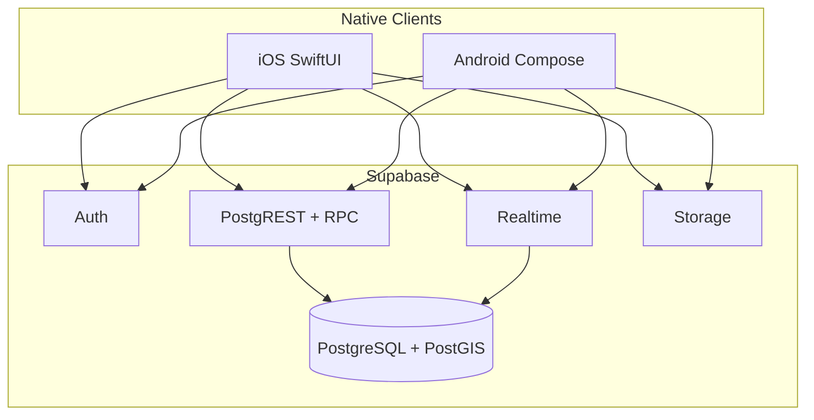

# Design Document — RollPhase Core

## Overview

RollPhase is a **native dual-client** product (SwiftUI + Jetpack Compose) on a **single Supabase backend** (Postgres + PostGIS + Auth + Realtime + Storage).

**Core design bet:** *Sport context is a global app state*, not a filter chip buried in search. Changing sport reloads scoped data. Screens never mix rank systems or facility types across sports.

**v1 depth sports:** Brazilian Jiu-Jitsu, MMA, Boxing, Wrestling, Weightlifting, CrossFit, Running, Climbing, Swimming, Yoga.

**Safety bet:** Matching pools are split by age band server-side (teen vs adult). Gym discovery stays open; social graph is gated.

---

## Architecture



### Client layers (both platforms)

| Layer | Responsibility |
|-------|----------------|
| **App / Navigation** | Tab shell, sport context store, deep links |
| **Feature modules** | Home, Gyms, Partners, Gear, Profile, Auth |
| **Domain** | Models, matching rules (display only), mappers |
| **Data** | Supabase client, repositories, Realtime subscriptions |
| **Design system** | Colors, type, 3D icons, components |

**No business-critical age or sport isolation in the client alone** — RLS + RPC enforce teen/adult split and sport filters.

### Shared contracts

- SQL migrations in `supabase/migrations/`
- RPC signatures documented in `docs/api-contracts.md` (created at implementation)
- Sport taxonomy seed JSON consumed by both apps (bundled + server is source of truth)

---

## Information Architecture (phone-first)

### Global chrome

1. **Sport selector** — sticky top chip or header control → full-screen searchable picker with 3D icons  
2. **Bottom tabs** — Home · Gyms · Partners · Gear · Profile  
3. **Sheets** — filters (radius, open now, rank band, amenities)

### Flow: first launch

```
Splash → Auth → DOB / age gate
  → Onboarding: pick primary sport(s) + level
  → Location permission
  → Home (active sport)
```

### Home (sport-scoped dashboard)

Surfaces only for **active sport**:

| Block | Content | Empty behavior |
|-------|---------|----------------|
| My status | Check-in state / open-to-train toggle | Compact CTA |
| Near you | Top 3–5 gyms: distance, open now, next class | Collapse + “expand map” |
| Training now | Partners/check-ins nearby | Collapse |
| Up next | Next event/promotion in radius | Collapse |
| Needs pulse | 1–2 local needs | Link to Gear tab |

**No infinite mixed feed.**

### Gyms

- Segment: **List | Map**
- Card: name · distance · open-now · sport specialty tags · next class
- Detail tabs: **Overview · Schedule · Here now · Promos · About**
- Filters sheet: radius, open now, amenities relevant to active sport

### Partners

- Filters: rank/level band, radius, intent (roll / spar / lift / open mat / run group…)
- Cards: display name · level · distance band · intent · mutual gym (if any)
- Teen UI: copy clarifies “Youth training partners”; no adult cards ever appear
- Actions: Request train · View profile · Report

### Gear

- Subsegments: **Shops | Needs** (segmented control — not mixed scroll)
- Need post: sport (pre-filled) · type · want/have · notes · radius

### Profile

- Multi-sport list with levels
- Privacy: open-to-train, show check-ins, approximate area
- Safety: blocked users, report history (user-facing: blocked list only)
- Age band displayed only as needed for compliance (not as a public brag field)

---

## Data Models (PostgreSQL + PostGIS)

### Core entities

```text
sports
  id, slug, name, icon_key, sort_order, has_formal_ranks, active

sport_rank_systems
  id, sport_id, name (e.g. "IBJJF Gi")

sport_ranks
  id, system_id, label, rank_order, color_token nullable

profiles
  id (auth.users FK), display_name, bio, birth_date, age_band,
  home_geog geography(Point,4326) nullable, home_geog_precision,
  avatar_url, created_at, is_suspended

profile_sports
  profile_id, sport_id, rank_id nullable, level_enum nullable,
  years_exp, is_primary, open_to_train

gyms
  id, name, description, geog geography(Point,4326),
  address_text, timezone, website, phone, claimed_by, verified

gym_sports
  gym_id, sport_id, specialties text[], is_primary

gym_hours
  gym_id, dow, open_time, close_time

gym_amenities
  gym_id, amenity_key  -- mats, cage, rack, pool, ropes, ...

class_sessions
  id, gym_id, sport_id, title, starts_at, ends_at, level_notes

promotions
  id, gym_id, sport_id nullable, title, body, starts_at, ends_at

check_ins
  id, profile_id, gym_id, sport_id, started_at, ends_at,
  looking_for_partner bool, geog nullable (adults optional)

partner_preferences
  profile_id, sport_id, min_rank_order, max_rank_order, radius_m, intents[]

match_requests
  id, from_id, to_id, sport_id, status, message, created_at

conversations / messages  -- only after accepted match (teens: extra checks)

gear_shops
  id, name, geog, hours, website, sports[]

needs
  id, profile_id, sport_id, kind (want|have|sell|trade),
  title, body, geog, active, created_at

events
  id, sport_id, gym_id nullable, title, starts_at, geog, ...

blocks, reports
  standard safety tables; reports.priority if involves_minor
```

### Age band (server-derived)

```text
age_band: 'blocked' | 'teen_young' | 'teen_old' | 'adult'
  under 13     → blocked (no account)
  13–15        → teen_young
  16–17        → teen_old
  18+          → adult
```

### Partner match RPC (conceptual)

```sql
-- nearby_partners(sport_id, lat, lng, radius_m, rank_min, rank_max)
-- Enforces:
--   1) same sport + open_to_train
--   2) caller.age_band matching rules:
--        adult     → only adult
--        teen_*    → only same teen band (or teen_young↔teen_young, teen_old↔teen_old)
--   3) ST_DWithin on home_geog or last_active_geog with precision floor
--   4) exclude blocks
```

### Nearby gyms RPC

```sql
-- nearby_gyms(sport_id, lat, lng, radius_m, open_now bool, amenities text[])
-- join gym_sports; order by geog <-> point; limit/offset
```

### Indexes

- `gyms` using GIST on `geog`
- `profiles` GIST on `home_geog` where not null
- `check_ins` partial index where `ends_at > now()`
- `profile_sports (sport_id, open_to_train)` composite
- `needs (sport_id, active)` + GIST geog

### RLS highlights

| Table | Policy sketch |
|-------|----------------|
| profiles | Public read of safe columns; owner write; birth_date never public |
| check_ins | Read active for gym members/public per privacy; insert own |
| match_requests | Parties only; insert only if age_band rules pass (RPC preferred) |
| messages | Conversation participants only |
| gyms | Public read; claim owner update |

**Critical:** Age isolation and teen/adult match prevention live in **SECURITY DEFINER RPCs** + RLS, not only in Swift/Kotlin.

---

## Sport taxonomy (v1 priority set)

| Sport | Rank system (v1) | Key amenities | Partner intents |
|-------|------------------|---------------|-----------------|
| BJJ | Belt + stripes (Gi/No-Gi flags) | Mats, cage optional | Roll, drill, open mat |
| MMA | Beginner→Pro levels | Cage, mats, bags | Spar, drill, conditioning |
| Boxing | Novice→Elite levels | Ring, bags | Spar, mitt, roadwork |
| Wrestling | HS / College / Open levels | Mats | Live go, drill |
| Weightlifting | Beginner→Competitive | Platforms, racks | Session partner, form check |
| CrossFit | Scaled / Rx / Competitive | Rigs, rowers | WOD partner |
| Running | Pace bands optional | Routes N/A (meet points) | Easy / tempo / long |
| Climbing | V-scale / YDS optional | Walls, gym | Belay, session |
| Swimming | Stroke level | Pool lanes | Lane partner |
| Yoga | Style tags (not belts) | Studio | Practice buddy |

Formal belts only where real (BJJ). Others use **level enum** + optional numeric grade fields — never fake belts.

---

## Real-time check-ins

- Channel: `gym:{gym_id}:checkins` (filter sport client-side or separate topic `gym:{id}:sport:{slug}`)
- Payload: profile public card, sport, looking_for_partner, started_at
- Teens: no lat/lng in payload; gym association only
- TTL: default 2h or gym close; manual checkout clears row and broadcasts delete

---

## UI / Visual system

### Brand direction

- **Name:** RollPhase  
- **Feel:** Premium athletic, calm confidence, “night gym + clean metal + mat texture” — not neon esports spam  
- **Logo:** 3D mark — abstract motion/roll + phase/shift (circular energy, depth, subtle sport-agnostic)  
- **Sport icons:** Unified 3D render style (same lighting, camera, materials) so the picker feels like one product

### Color & type (platform tokens)

| Token | Role |
|-------|------|
| `bg.primary` | Near-black / deep slate (OLED-friendly) |
| `bg.elevated` | Card surfaces |
| `accent.sport` | Per-sport subtle accent (from sport token) |
| `text.primary` / `secondary` | Hierarchy |
| `status.open` | Green “open now” |
| `status.live` | Check-in pulse |

Typography: SF Pro (iOS) / Roboto or system (Android) — large titles, tight secondary labels, no dense paragraphs on cards.

### Component inventory

- `SportChip`, `SportPickerScreen`
- `GymCard`, `PartnerCard`, `NeedCard`
- `FilterSheet`, `MapListToggle`
- `CheckInBar`, `OpenToTrainToggle`
- `EmptyCollapsed` (prefer hide over “nothing here” walls)
- `AgeGate`, `SafetyBanner` (teens)

### Anti-clutter rules (implementation checklist)

1. Never show rank UI for sports without ranks  
2. Never show other sports’ amenities on a card unless multi-sport gym and user expanded “also offers”  
3. Collapse empty Home modules  
4. Detail uses tabs, not one long scroll of N/A  
5. Search defaults to active sport  

---

## Native platform notes

| Concern | iOS | Android |
|---------|-----|---------|
| Maps | MapKit | Google Maps / platform Maps |
| Location | Core Location | Fused Location |
| Push | APNs via Supabase/FCM bridge | FCM |
| Auth UI | ASWebAuthenticationSession / native | Chrome Custom Tabs / native |
| Icons | PDF/SVG → Assets, dark mode variants | Vector + xxxhdpi PNG exports |
| Min OS | iOS 17+ target (TBD confirm) | API 28+ (TBD confirm) |

Feature modules stay parallel in repo:

```text
apps/ios/RollPhase/
apps/android/RollPhase/
supabase/
docs/
brand/
packages/contracts/   # optional OpenAPI / shared JSON taxonomy
```

---

## Error handling

| Scenario | Behavior |
|----------|----------|
| Location denied | Manual city/pin; still query PostGIS from pin |
| RPC age violation | 403 + friendly “not available for your account type” |
| No gyms in radius | Empty state: expand radius / change sport |
| Realtime drop | Resubscribe; fallback poll check-ins every 30s |
| Profile incomplete | Soft gate: sport + DOB required before Partners |

---

## Testing strategy

1. **SQL tests** — age_band derivation; partner RPC never returns cross-pool rows  
2. **PostGIS** — distance ordering fixture gyms  
3. **RLS** — anon vs auth vs teen message paths  
4. **iOS/Android UI tests** — sport switch clears wrong rank filters  
5. **Contract tests** — both clients against local Supabase  

---

## Security summary

- DOB private; only `age_band` used in match logic  
- Teen↔adult match and message = impossible at RPC  
- Reports involving minors priority queue  
- Exact home location never on public profile  
- Gym claim verification before edit rights  

---

## Implementation phases (preview — formal tasks after approval)

1. Brand assets (logo + 10 sport icons)  
2. Supabase schema + RLS + RPCs + seeds  
3. iOS skeleton: auth, sport context, tabs  
4. Android skeleton: parity  
5. Gyms discovery + map  
6. Partners + age rules  
7. Check-ins Realtime  
8. Gear + needs  
9. Gym claim/edit light  
10. Polish + store prep  

---

## Open design details (minor; can refine in tasks)

- Exact teen age band cut (13–15 / 16–17) vs single teen pool  
- Guardian email required vs optional for 16–17  
- Min OS versions  
- Map provider on Android (Google vs OSM)  
